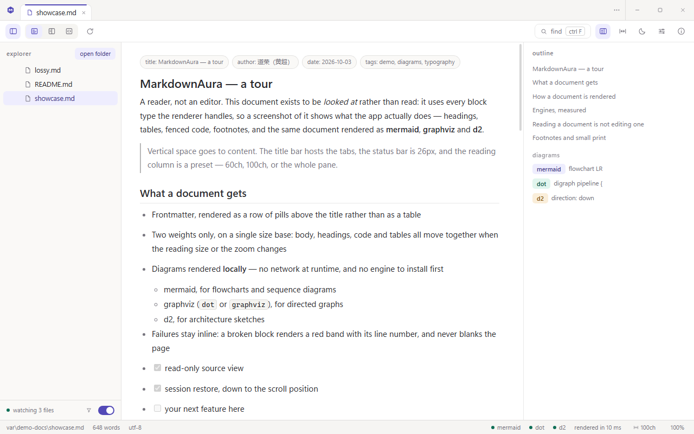
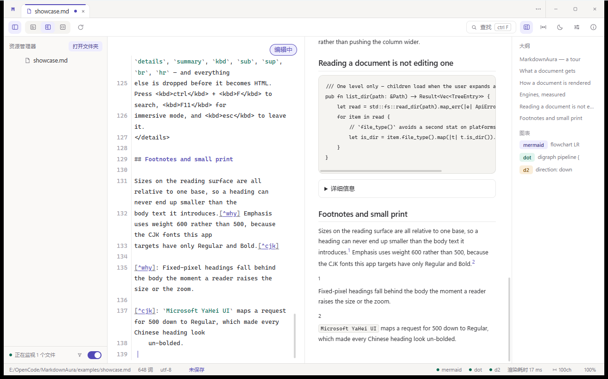
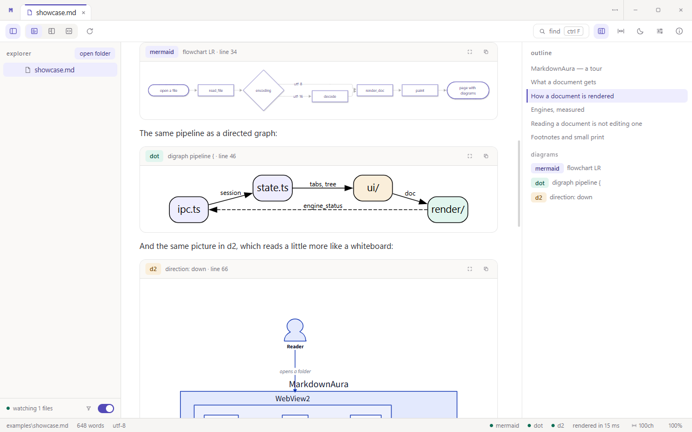
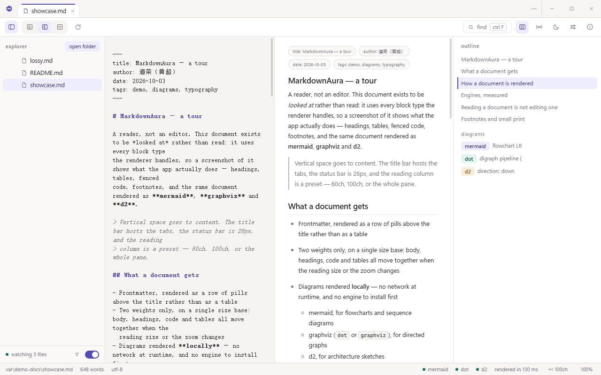
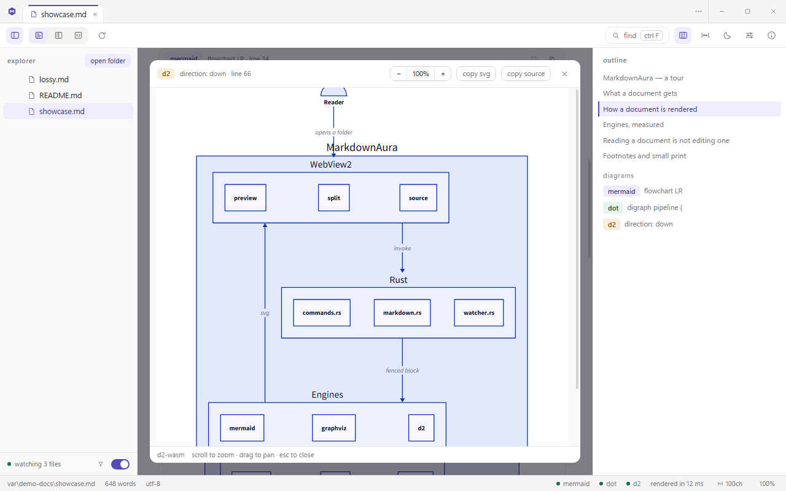
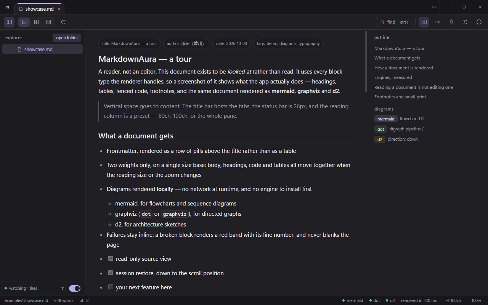

[English](README.md) · **简体中文**

# MarkdownAura

**给 Windows 与 Linux 的一个 Markdown 阅读器——默认只读，按需即可编辑。**



- 三种视图：预览 / 分屏 / 源码，一键切换，分屏宽度可拖
- 图表**本地**渲染：mermaid、graphviz (dot)、d2 三个引擎全部内置——画图这一步不联网，也不采集任何数据
- 代码围栏按语言着色（约 50 种语言）、脚注收拢到文末、公式由 KaTeX 排版——数学默认关闭，设置里一键打开
- 关掉再打开，标签页、滚动位置、文件夹、窗口大小与全部设置都回来

---

## 为什么用它

**它首先是阅读器，你要编辑时才成为编辑器。**
源码视图以只读打开——没有光标、没有撤销、没有保存，也没有"未保存"的打扰——直到你用 `ctrl E`（或点击那枚 `只读` 药丸，它会变成 `编辑中`）进入编辑。模式属于单个标签页，且从不随会话还原，所以恢复会话一律回到只读。保存（`ctrl S`）按文件自身的编码与行尾写回，无法忠实往返的文件宁可拒绝也不损坏。侧栏、大纲、工具栏随时可收，纵向空间留给正文。

**三个图表引擎全部内置，画图这一步不联网。应用唯一会自行发起的请求是启动时取一次更新清单**——一个版本号与一个下载地址，不含任何关于你的信息（「关于」面板里也是这句话）。
`mermaid`、`dot` / `graphviz`、`d2` 都在本地渲染，不请求任何远端服务，也不需要先"安装引擎"。引擎出错时在图表卡片内就地报错（带源码行号），不会清空页面。

**渲染细节按读者的预期来。**
代码围栏按语言着色（Prism，约 50 种语法；没随包的语言保持纯文本，不会为此报错），脚注收拢成文末一个编号区块、每条都有 `↩` 跳回引用处，公式由 KaTeX 排版——`$…$`、`$$…$$`，含化学式。数学是这里唯一的开关：它默认关闭，因为打开之后 `$` 就不再是普通字符，而一篇在讲价格的文档应该继续讲价格。中日文按读法写强调——`中文**"加粗"**中文` 就是粗体，而 CommonMark 会拒绝这个形态（它的规则把汉字当成拉丁字母）；marktext、Typora 与 VS Code 预览放宽的都是同一个形态，其它一律不动。

**大文件与各种编码都不挡路。**
单文件读取上限 8 MiB，超出部分明确标注"已截断"而不是悄悄丢内容；UTF-8、UTF-8 BOM、UTF-16LE、UTF-16BE 自动识别，LF / CRLF 也在状态栏标明。

**每个标签页记住自己的状态。**
视图模式、滚动位置、查找词与命中位置按标签页保存，切回来不重新渲染。

**会话恢复是"回来了"，不是"重开了"。**
再次启动时，标签页（含预览标签）、打开过的文件夹、窗口几何、主题、字号、缩放、阅读宽度、侧栏与大纲宽度全部还原；文件临时不在也只是划掉，不会消失。

**中文排版有真实字重。**
标题与粗体用 600 而不是 500：`Microsoft YaHei UI` 只有 Regular/Bold 两档，500 会被就近渲染成 Regular，中文标题会看不出加粗。

**字号只有一套基准。**
正文、标题、代码、表格、源码窗格都相对"字号设置 × 缩放"，调任一项时整篇文档一起变——不会出现标题比正文还小、源码窗格跟预览不一样大这类事。

**安装不需要联网。**
安装包自带 WebView2 加载器；只有当目标机缺 WebView2 Runtime（Win11 与装了 Edge 的 Win10 已自带）时，安装器才会去获取它。

---

## 功能

| 区域 | 能力 |
|---|---|
| 资源管理器 | 打开文件夹；宽度可拖（180–640px）；**只列 md** 开关（默认开）；文件名筛选（脚部漏斗按需展开）；目录始终显示；忽略的目录：`.` 开头、`node_modules`、`target`、`dist`；底部显示 `正在监视 N 个文件` |
| 打开方式 | 应用会把自身注册为 Markdown 文件的打开方式（Windows 安装包与两个 Linux 包都是），文件管理器的"用……打开"会把路径传进来；第二次启动转交给已打开的窗口，而不是再开一个 |
| 标签页 | 单击树中文件开"预览标签"（斜体），双击固定；`⋯` 列出全部标签；`ctrl W` 或中键关闭；右键菜单可关闭 / 关闭其它 / 关闭右侧 / 全部关闭、复制路径、在资源管理器中显示 |
| 视图 | 预览 / 分屏 / 源码；分屏可拖分隔条；分屏两窗格同步滚动，位置按标签页保存 |
| 渲染 | CommonMark，外加 GFM 的表格、任务清单与删除线——不含 GFM autolink 扩展，所以裸写的 `www.…` 或邮箱仍是文本，而 `<https://…>` 是链接；脚注收拢为文末一个区块，每条都有 `↩` 跳回引用处；**代码围栏按语言着色**（Prism，约 50 种语言，没随包的语言保持纯文本、不打扰）；**数学公式**由 KaTeX 渲染（`$…$`、`$$…$$`，含化学式），这是一项设置，默认关闭 |
| 编辑 | `ctrl E`（或点 `只读` 药丸）在该标签页的源码窗格放进光标，按标签页独立、从不还原；分屏下预览随输入实时更新；`ctrl S` 保存——按文件自身编码与行尾写回，原子写入并保留权限——状态栏那枚 `未保存` 同时也是保存按钮；已被外部改动、只读、行尾混用、非合法 UTF-8 的文件一律拒绝而不损坏。CodeMirror 6 按需加载 |
| 图表 | mermaid / dot / d2 卡片：引擎徽章、首行标题、源码行号；卡片先出现在围栏的位置、等引擎给出结果再填入，渲染失败的那张留在原处并保留徽章与锚点（大纲、查看器目标、分栏同步仍然找得到它），只是失去 `放大` 按钮；`放大` 打开查看器（滚轮缩放、拖拽平移、复制 SVG、复制源码、`esc` 关闭） |
| 查找 | `ctrl F`、区分大小写、命中计数、上/下一处 |
| 大纲 | 1–4 级标题与图表列表，点击跳转，宽度可拖 |
| 阅读 | 正文字号 12–22px；阅读宽度三档（窄 60ch / 舒适 100ch / 撑满）；浅色 / 深色 / 跟随系统；语言跟随系统（中 / 英）；减少动效 |
| 沉浸 | `F11` 收掉全部界面 chrome，`esc` 或 `F11` 退出 |
| 帮助 | `F1` 快捷键表，以及每个引擎一张图语法卡片 |
| 关于 | 版本、作者、许可证、三个图表引擎与编辑器各自的许可证与体积、数据目录（可直接打开）、日志目录（可直接打开）、项目主页链接，以及 **检查更新** 一行。这一行在启动时也会自行运行：取一份很小的清单（一个版本号与一个下载地址），发现更新的版本时状态栏会长出一枚提示，点它即打开本面板——两种情况都不会发送任何关于你的信息 |
| 设置（覆盖层，非第二个窗口） | 主题 / 语言 / 字号 / 阅读宽度 / 数学公式 / 减少动效 / 默认应用 / 渲染缓存大小与清空 / 日志级别与日志目录 —— 每一行都真的能改 |
| 数据 | Windows 下是 `%APPDATA%\MarkdownAura\session.json`，Linux 下是 `~/.config/MarkdownAura/session.json`，原子写入（崩溃不丢上一次会话）；渲染缓存按 SVG 字节计，可一键清空；运行日志是 `%LOCALAPPDATA%\MarkdownAura\logs`（Linux 为 `$XDG_STATE_HOME/MarkdownAura/logs`）下 4 MB 的滚动文件，每次异常退出都在 `crash/` 下自动留一份自包含报告，目录本身可配置 |

原始 HTML 只放行一小段固定标签（`details`、`summary`、`kbd`、`sub`、`sup`、`br`、`hr`），其余一律丢弃——文档里写什么都不会影响应用界面。

---

## 图表引擎

| 引擎 | 围栏标注 | 许可证 | 随包体积 |
|---|---|---|---|
| mermaid | `mermaid` | MIT | 29 KB 入口 + 按需分块（磁盘 5.18 MB，只加载用到的图类型） |
| graphviz | `dot`、`graphviz` | Apache-2.0 | 约 0.9 MB（wasm 内联在 JS 中） |
| d2 | `d2` | MPL-2.0 | 11.5 MB（wasm 内联在 JS 中） |

三者都在应用内运行，任何文档都不需要网络。

---

## 快捷键

| 分组 | 按键 | 作用 |
|---|---|---|
| 文件 | `ctrl O` / `ctrl shift O` | 打开文件 / 打开文件夹 |
| 文件 | `ctrl shift P` / `ctrl shift A` | 最近文件 / 标签页列表 |
| 文件 | `ctrl W` / `ctrl tab` / `ctrl 1-9` | 关闭 / 下一个 / 跳转标签页 |
| 视图 | `ctrl B` / `ctrl alt O` | 侧栏 / 大纲 |
| 视图 | `ctrl R` | 重新渲染当前文档 |
| 视图 | `ctrl ,` / `F1` | 设置 / 帮助 |
| 视图 | `F11` | 沉浸模式 |
| 视图 | `ctrl +` `ctrl -` / `ctrl 0` | 缩放 / 重置缩放 |
| 视图 | `ctrl shift M` | 切换阅读宽度 |
| 文件 | `ctrl E` / `ctrl S` | 就地编辑本标签页源码 / 保存 |
| 查找 | `ctrl F`，`enter` / `shift enter`，`esc` | 查找、下一处 / 上一处、关闭 |

---

## 安装与运行

- **免安装版（zip，Windows x64）**：`MarkdownAura-<version>-windows-x64-portable.zip` 里是 `markdownaura.exe` 与它需要的 `WebView2Loader.dll`。解压到任意位置双击 exe 即可（只拷 exe 无法启动）。不再提供单文件版——0.1.2 起移除，因为承载它的那个壳等于自带一套升级逻辑，却换不来 zip 做不到的事。
- **安装版（Windows x64）**：`MarkdownAura_<version>_windows-x64-setup.exe`。安装向导含许可页，并把 `LICENSE` 与 `THIRD-PARTY.md` 放进安装目录。它同时也是升级通道：存在更新版本时状态栏会出现一枚提示，点它打开关于面板，其中的 **检查更新** 会从 GitHub release 下载下一个已签名的安装包并运行。免安装版这样升级后会变成正式安装；想保持免安装，就到 release 页手动下载新的 zip。
- **Linux（x86-64）**：`MarkdownAura_<version>_linux-amd64.deb` 用 `sudo apt install ./MarkdownAura_<version>_linux-amd64.deb` 安装，依赖会自动带上 WebKitGTK 4.1；`MarkdownAura_<version>_linux-amd64.AppImage` 不需要预装任何东西——工具链装在它自己里面，这也正是两者体积差的来源。两者都会把本应用注册为 Markdown 文件的打开方式。deb 装的那份归包管理器升级，AppImage 则是应用内更新时被替换的那个产物。
- **系统要求**：Windows 10 / 11（x64）+ WebView2 Runtime（Win11 与装了 Edge 的 Win10 已自带）；Linux（x86-64），deb 需要 WebKitGTK 4.1，AppImage 无需预装。
- **体积**：免安装 zip 13.3 MB；安装包 13.0 MB；deb 13.8 MB；AppImage 89.1 MB（内含 WebKitGTK）。

---

## 从源码构建

前置：Node 22+、目标为 `x86_64-pc-windows-gnu` 的 Rust 工具链、WebView2 Runtime。GNU 构建依赖 `tools/unpack-binutils.mjs` 的 binutils 垫片与 `tools/rc-preprocessor.rs` 的 `gcc` 替身——动工具链前先读 `design/IMPL.md` §1。Linux 侧：Node 22+、Rust 工具链，以及 WebKitGTK 4.1 / GTK 3 开发包（`libwebkit2gtk-4.1-dev`、`libgtk-3-dev`、`librsvg2-dev`、`libssl-dev`）；`npx tauri build --bundles deb,appimage` 一次产出两个产物。

```bash
npm install
npm run dev            # 只起前端，在浏览器里看界面
npm run tauri dev      # 真正的应用窗口
npm run build:prod     # 生产构建：前端 + release 二进制
npm run typecheck      # TypeScript 检查
npm run check:prose    # 设计约束检查（阅读栏居中、字号相对基准）
npm run check:rawhtml  # 校验 mockup 是否遵守原始 HTML 白名单
npm run notices        # 依据真实依赖树重新生成 THIRD-PARTY.md
```

`build:prod` 只产出 `dist/` 与 release 二进制；安装包、免安装 zip 与 `latest.json` 是需要签名的另一条流程——见 `design/IMPL.md` §12。

---

## 截图

均为真机截图，分辨率 1280 × 800，打开的是 [`examples/showcase.md`](examples/showcase.md)——一份用上渲染器所有块类型、并同时含三个图表引擎的文档。



|  |  |
|---|---|
|  |  |
| 一份文档里的三个引擎——每张卡片带引擎徽章、图表首行标题与源码行号。 | 源码与预览并排——分隔条可拖，两窗格同步滚动。 |
|  |  |
| 图表查看器——滚轮缩放、拖拽平移、复制 SVG 或源码、`esc` 关闭。 | 深色主题——浅色 / 深色 / 跟随系统，整个界面一起变。 |

设计参考稿是 [`design/mockup.html`](design/mockup.html)：用浏览器直接打开即可——不需要构建、不需要联网，能点一遍全部界面。

---

## 许可证

本项目为 MIT，见 [`LICENSE`](LICENSE)。第三方组件与许可证见 [`THIRD-PARTY.md`](THIRD-PARTY.md)，由 `npm run notices` 依据构建实际解析到的依赖生成。
