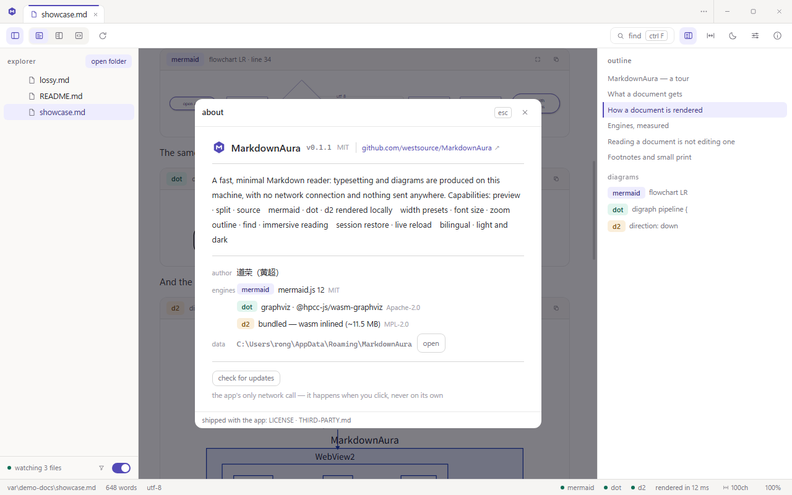

[English](README.md) · **简体中文**

# MarkdownAura

给 Windows 的一个 Markdown **阅读器**——为"读得舒服"而做，不为编辑。


- 三种视图：预览 / 分屏 / 源码，一键切换，分屏宽度可拖
- 图表**本地**渲染：mermaid、graphviz (dot)、d2 三个引擎全部内置，运行时零联网、无遥测
- 关掉再打开，标签页、滚动位置、文件夹、窗口大小与全部设置都回来

---

## 为什么用它

**它是阅读器，不是编辑器。**
源码视图只读——没有光标、没有撤销、没有保存，也没有"未保存"的打扰。侧栏、大纲、工具栏随时可收，纵向空间留给正文。

**三个图表引擎全部内置，全程不联网。**
`mermaid`、`dot` / `graphviz`、`d2` 都在本地渲染，不请求任何远端服务，也不需要先"安装引擎"。引擎出错时在图表卡片内就地报错（带源码行号），不会清空页面。

**大文件与各种编码都不挡路。**
单文件读取上限 8 MiB，超出部分明确标注"已截断"而不是悄悄丢内容；UTF-8、UTF-8 BOM、UTF-16LE、UTF-16BE 自动识别，LF / CRLF 也在状态栏标明。

**每个标签页记住自己的状态。**
视图模式、滚动位置、查找词与命中位置按标签页保存，切回来不重新渲染。

**会话恢复是"回来了"，不是"重开了"。**
再次启动时，标签页（含预览标签）、打开过的文件夹、窗口几何、主题、字号、缩放、阅读宽度、侧栏与大纲宽度全部还原；文件临时不在也只是划掉，不会消失。

**中文排版有真实字重。**
标题与粗体用 600 而不是 500：`Microsoft YaHei UI` 只有 Regular/Bold 两档，500 会被就近渲染成 Regular，中文标题会看不出加粗。

**字号只有一套基准。**
正文、标题、代码、表格、源码窗格都相对"字号设置 × 缩放"，调任一项时整篇文档一起变——不会出现标题比正文还小、源码窗格跟预览不一样大这类事。

**安装不需要联网。**
安装包自带 WebView2 加载器；只有当目标机缺 WebView2 Runtime（Win11 与装了 Edge 的 Win10 已自带）时，安装器才会去获取它。

---

## 功能

| 区域 | 能力 |
|---|---|
| 资源管理器 | 打开文件夹；宽度可拖（180–640px）；**只列 md** 开关（默认开）；文件名筛选（脚部漏斗按需展开）；目录始终显示；忽略的目录：`.` 开头、`node_modules`、`target`、`dist`；底部显示 `正在监视 N 个文件` |
| 标签页 | 单击树中文件开"预览标签"（斜体），双击固定；`⋯` 列出全部标签；`ctrl W` 关闭 |
| 视图 | 预览 / 分屏 / 源码；分屏可拖分隔条；分屏两窗格同步滚动，位置按标签页保存 |
| 图表 | mermaid / dot / d2 卡片：引擎徽章、首行标题、源码行号；`放大` 打开查看器（滚轮缩放、拖拽平移、复制 SVG、复制源码、`esc` 关闭） |
| 查找 | `ctrl F`、区分大小写、命中计数、上/下一处 |
| 大纲 | 1–4 级标题与图表列表，点击跳转，宽度可拖 |
| 阅读 | 正文字号 12–22px；阅读宽度三档（窄 60ch / 舒适 100ch / 撑满）；浅色 / 深色 / 跟随系统；语言跟随系统（中 / 英）；减少动效 |
| 沉浸 | `F11` 收掉全部界面 chrome，`esc` 或 `F11` 退出 |
| 帮助 | `F1` 快捷键表，以及每个引擎一张图语法卡片 |
| 关于 | 版本、作者、许可证、三个引擎及其许可证、数据目录（可直接打开）、项目主页链接，以及 **检查更新** 一行——应用唯一会联网的动作，且只在你点击时发生 |
| 设置（覆盖层，非第二个窗口） | 主题 / 语言 / 字号 / 阅读宽度 / 减少动效 / 引擎体积 / 监视去抖 / 渲染缓存大小与清空 |
| 数据 | `%APPDATA%\MarkdownAura\session.json`，原子写入（崩溃不丢上一次会话）；渲染缓存按 SVG 字节计，可一键清空 |

原始 HTML 只放行一小段固定标签（`details`、`summary`、`kbd`、`sub`、`sup`、`br`、`hr`），其余一律丢弃——文档里写什么都不会影响应用界面。

---

## 图表引擎

| 引擎 | 围栏标注 | 许可证 | 随包体积 |
|---|---|---|---|
| mermaid | `mermaid` | MIT | 29 KB 入口 + 按需分块（磁盘 5.18 MB，只加载用到的图类型） |
| graphviz | `dot`、`graphviz` | Apache-2.0 | 约 0.9 MB（wasm 内联在 JS 中） |
| d2 | `d2` | MPL-2.0 | 11.5 MB（wasm 内联在 JS 中） |

三者都在应用内运行，任何文档都不需要网络。

---

## 快捷键

| 分组 | 按键 | 作用 |
|---|---|---|
| 文件 | `ctrl O` / `ctrl shift O` | 打开文件 / 打开文件夹 |
| 文件 | `ctrl shift P` / `ctrl shift A` | 最近文件 / 标签页列表 |
| 文件 | `ctrl W` / `ctrl tab` / `ctrl 1-9` | 关闭 / 下一个 / 跳转标签页 |
| 视图 | `ctrl B` / `ctrl alt O` | 侧栏 / 大纲 |
| 视图 | `ctrl R` | 重新渲染当前文档 |
| 视图 | `ctrl ,` / `F1` | 设置 / 帮助 |
| 视图 | `F11` | 沉浸模式 |
| 视图 | `ctrl +` `ctrl -` / `ctrl 0` | 缩放 / 重置缩放 |
| 视图 | `ctrl shift M` | 切换阅读宽度 |
| 查找 | `ctrl F`，`enter` / `shift enter`，`esc` | 查找、下一处 / 上一处、关闭 |

---

## 安装与运行

- **免安装版（zip）**：`MarkdownAura-<version>-portable.zip` 里是 `markdownaura.exe` 与它需要的 `WebView2Loader.dll`。解压到任意位置双击 exe 即可（只拷 exe 无法启动）。
- **免安装版（单文件）**：`MarkdownAura-<version>-portable.exe` 把上面两个文件装进一个文件里。首次启动时解包到 `%LOCALAPPDATA%\MarkdownAura\portable\<version>\` 并从中运行，因此它不需要旁边有任何东西，可以直接当"一个文件"发给人；解包出来的 exe 与构建产物字节一致，且若应用后来升级过，壳会改跑那份更新的副本而不是自己冻结的那份。
- **安装版**：`MarkdownAura_<version>_x64-setup.exe`。安装向导含许可页，并把 `LICENSE` 与 `THIRD-PARTY.md` 放进安装目录。它同时也是升级通道：关于面板的 **检查更新** 会从 GitHub release 下载下一个已签名的安装包并运行。免安装版这样升级后会变成正式安装；想保持免安装，就到 release 页手动下载新的 zip。
- **系统要求**：Windows 10 / 11（x64）+ WebView2 Runtime（Win11 与装了 Edge 的 Win10 已自带）。
- **体积**：免安装 zip 约 12.1 MB；单文件版约 16.6 MB（未压缩）；安装包 11.8 MB。

---

## 从源码构建

前置：Node 22+、目标为 `x86_64-pc-windows-gnu` 的 Rust 工具链、WebView2 Runtime。GNU 构建依赖 `tools/unpack-binutils.mjs` 的 binutils 垫片与 `tools/rc-preprocessor.rs` 的 `gcc` 替身——动工具链前先读 `design/IMPL.md` §1。

```bash
npm install
npm run dev            # 只起前端，在浏览器里看界面
npm run tauri dev      # 真正的应用窗口
npm run build:prod     # 生产构建：前端 + release 二进制
npm run typecheck      # TypeScript 检查
npm run check:prose    # 设计约束检查（阅读栏居中、字号相对基准）
npm run check:rawhtml  # 校验 mockup 是否遵守原始 HTML 白名单
npm run notices        # 依据真实依赖树重新生成 THIRD-PARTY.md
```

`build:prod` 只产出 `dist/` 与 release 二进制；安装包、免安装 zip 与 `latest.json` 是需要签名的另一条流程——见 `design/IMPL.md` §12。

---

## 截图

均为真机截图，分辨率 1280 × 800，打开的是 [`examples/showcase.md`](examples/showcase.md)——一份用上渲染器所有块类型、并同时含三个图表引擎的文档。

|  |  |
|---|---|
|  |  |
| 一份文档里的三个引擎——每张卡片带引擎徽章、图表首行标题与源码行号。 | 源码与预览并排——分隔条可拖，两窗格同步滚动。 |
|  |  |
| 图表查看器——滚轮缩放、拖拽平移、复制 SVG 或源码、`esc` 关闭。 | 深色主题——浅色 / 深色 / 跟随系统，整个界面一起变。 |

**关于**——版本、作者、引擎清单与体积、数据目录，以及应用唯一会联网的动作。



设计参考稿是 [`design/mockup.html`](design/mockup.html)：用浏览器直接打开即可——不需要构建、不需要联网，能点一遍全部界面。

---

## 许可证

本项目为 MIT，见 [`LICENSE`](LICENSE)。第三方组件与许可证见 [`THIRD-PARTY.md`](THIRD-PARTY.md)，由 `npm run notices` 依据构建实际解析到的依赖生成。
