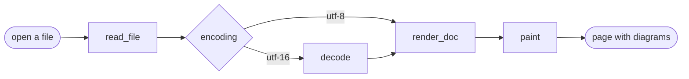
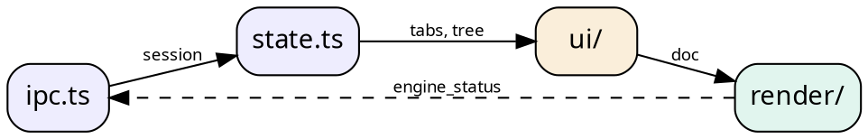

# MarkdownAura — a tour

A reader, not an editor. This document exists to be *looked at* rather than read: it uses every block type
the renderer handles, so a screenshot of it shows what the app actually does — headings, tables, fenced
code, footnotes, and the same document rendered as **mermaid**, **graphviz** and **d2**.

> Vertical space goes to content. The title bar hosts the tabs, the status bar is 26px, and the reading
> column is a preset — 60ch, 100ch, or the whole pane.

## What a document gets

- Frontmatter, rendered as a row of pills above the title rather than as a table
- Two weights only, on a single size base: body, headings, code and tables all move together when the
  reading size or the zoom changes
- Diagrams rendered **locally** — no network at runtime, and no engine to install first
  - mermaid, for flowcharts and sequence diagrams
  - graphviz (`dot` or `graphviz`), for directed graphs
  - d2, for architecture sketches
- Failures stay inline: a broken block renders a red band with its line number, and never blanks the page

- [x] read-only source view
- [x] session restore, down to the scroll position
- [ ] your next feature here

## How a document is rendered



The same pipeline as a directed graph:



And the same picture in d2, which reads a little more like a whiteboard:

```d2
direction: down

reader: Reader {
  shape: person
}

app: MarkdownAura {
  ui: WebView2 {
    preview: preview
    split: split
    source: source
  }
  rust: Rust {
    commands: commands.rs
    markdown: markdown.rs
    watcher: watcher.rs
  }
  engines: Engines {
    mermaid
    graphviz
    d2
  }
}

reader -> app.ui: opens a folder
app.ui -> app.rust: invoke
app.rust -> app.engines: fenced block
app.engines -> app.ui: svg
```

## Code and formulas

A fenced block is highlighted per language (Prism, about 50 grammars, loaded only when a document has a
fence), and every block carries its language and a copy button above it — outside the block, so the button
does not scroll away when a long line does.

```python
def reading_measure(chars: int) -> str:
    """A measure in `ch`, which is the only unit that survives a window resize."""
    return f"{chars}ch"  # 60 · 100 · pane
```

Inline math and a display block are KaTeX's: `$a^2 + b^2 = c^2$`. **Math ships off** — *settings → math*
turns it on, because enabling it takes `$` away from ordinary text and a sentence about prices should stay
a sentence about prices.

$$
\int_0^1 x\,dx = \frac{1}{2}
$$

## Chinese text writes emphasis the way it is read

Chinese and Japanese have no word spacing, so `中文**"加粗"**中文` is ordinary prose — and CommonMark
refuses it, because its flanking rules treat an ideograph exactly like a Latin letter. This renderer
widens that one shape and nothing else, which is what `marktext`, Typora and VS Code do as well:
中文**"加粗"**中文 是粗体, `中文**加粗 **中文` keeps the `**` it was written with (a space before a
closer must never close), and a Latin neighbour is left to CommonMark, where **bold next to "quotes"**
already works.

## Engines, measured

| Engine | Fence label | Licence | Shipped cost |
|---|---|---|---|
| mermaid | `mermaid` | MIT | 29 KB entry, chunks on demand |
| graphviz | `dot`, `graphviz` | Apache-2.0 | ~0.9 MB, wasm inlined |
| d2 | `d2` | MPL-2.0 | 11.5 MB, wasm inlined |

The reading measure is one column for every block, so this table lines up with the paragraphs around it —
and scrolls sideways rather than pushing the column wider.

## Reading a document is not editing one

```rust
/// One level only — children load when the user expands a node.
pub fn list_dir(path: &Path) -> Result<Vec<TreeEntry>> {
    let read = std::fs::read_dir(path).map_err(|e| ApiError::io(path, e))?;
    for item in read {
        // `file_type()` avoids a second stat on platforms that report it inline.
        let is_dir = item.file_type().map(|t| t.is_dir()).unwrap_or(false);
    }
}
```

<details>
<summary>Raw HTML in a source document</summary>

Only a short allow-list survives — `details`, `summary`, `kbd`, `sub`, `sup`, `br`, `hr` — and everything
else is dropped before it becomes HTML. Press <kbd>ctrl</kbd> + <kbd>F</kbd> to search, <kbd>F11</kbd> for
immersive mode, and <kbd>esc</kbd> to leave it.
</details>

## Every block, on one page

A document is a handful of blocks used again and again: a heading, a paragraph with **weight**,
*emphasis* and `inline code`, a [link](https://github.com/westsource/MarkdownAura), a list that nests,
a table that lines up, a quote that indents, and a fence that is left exactly as it was written.

1. an ordered list, for the steps that have an order
2. a bullet under it, for the detail
   - `ctrl E` starts the editor, and the pill reads `editing` instead of `read-only`
   - `ctrl S` writes the buffer back in the file's own encoding and line endings
3. a task list, for what is still open

- [x] a preview that follows the buffer as it is typed
- [ ] the block type this document has not met yet

> A quote is the reading column, indented once, and it can hold a list — which is how a document
> states a rule without giving the rule a heading of its own.

| Column | Carries | Set by |
|---|---|---|
| prose | the reading column | `--measure` |
| code | weight 600, on one size base | `prose.css` |
| a diagram | an engine badge and the first source line | `render/` |

```rust
/// A fence keeps its own line endings and is never reflowed or re-wrapped.
pub fn save_doc(path: &Path, text: &str, eol: Eol) -> Result<()> {
    write_atomic(path, text, eol)
}
```

## Footnotes and small print

Sizes on the reading surface are all relative to one base, so a heading can never end up smaller than the
body text it introduces.[^why] Emphasis uses weight 600 rather than 500, because the CJK fonts this app
targets have only Regular and Bold.[^cjk]

[^why]: Fixed-pixel headings fall behind the body the moment a reader raises the size or the zoom.

[^cjk]: `Microsoft YaHei UI` maps a request for 500 down to Regular, which made every Chinese heading look
    un-bolded.
